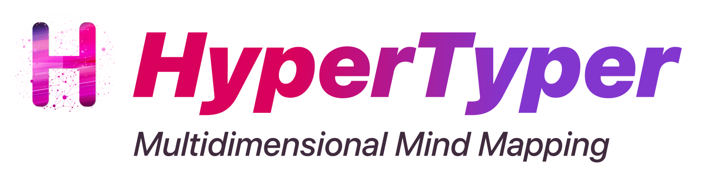

## HyperTyper



<div class="badges" style="text-align: center; margin-top: -10px;">
<a href="https://github.com/themaximal1st/hypertyper"></a>
<a href="https://www.npmjs.com/package/@themaximalist/hypertyper"></a>
<a href="https://github.com/themaximal1st/hypertyper"></a>
<a href="https://github.com/themaximal1st/hypertyper"></a>
</div>
<br />

## Install

```bash
$ npm install
```

## Development

```bash
$ npm run dev
```

## Build

```bash
# For windows
$ npm run build:win

# For macOS
$ npm run build:mac

# For Linux
$ npm run build:linux
```
